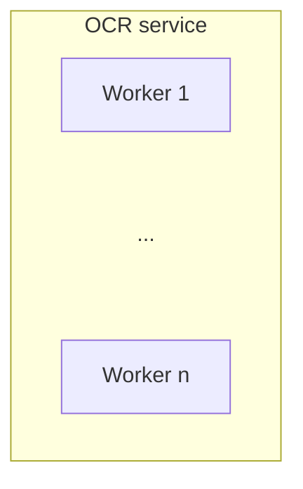

# Project Overengineer
An AI-powered service that converts receipt images into structured, itemized text. 

Built for scalability and deployed to both Kubernetes and Docker Swarm, this service includes comprehensive observability, telemetry, monitoring, and alerting infrastructure (standard as of 2025).

Infrastructure provisioning is fully managed via Terraform.

## Why?
As the name suggests, this project is intentionally overengineered beyond its simple purpose. The focus isn’t the service itself; it's an exercise in implementing everything around it!

## Base architecture
The service consists of X components:

- **Client**: A frontend client written in Next.js.
- **Frontend cluster**: 
- **Transformer API**:
- **Redis cluster**:
- **Status API**: 
- **OCR service**:

## Reliability plane architecture

## Architecture

