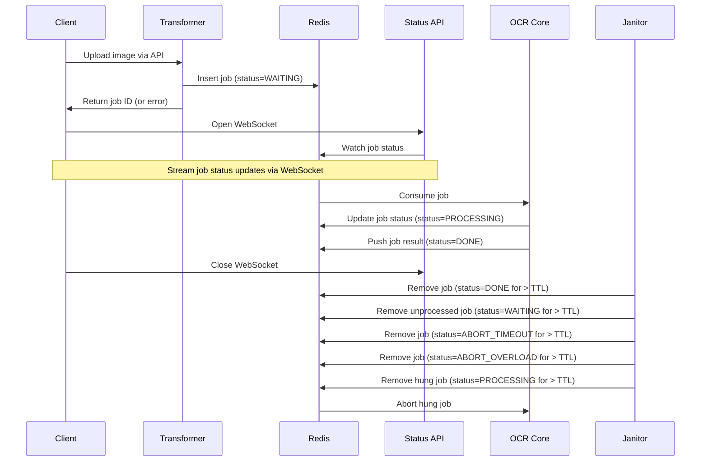

# Project Overengineer
An AI-powered service that converts receipt images into structured, itemized text. 

Built for scalability and deployed to both Kubernetes and Docker Swarm, this service includes comprehensive observability, telemetry, monitoring, and alerting infrastructure (standard as of 2025).

Infrastructure provisioning is fully managed via Terraform.

## Why?
As the name suggests, this project is intentionally overengineered beyond its simple purpose. The focus isn’t the service itself; it's an exercise in implementing everything around it!

## Base architecture
The service consists of X components:

- **Client**: A frontend client written in Next.js.
- **Frontend Cluster**: 
- **Transformer**:
- **Redis**:
- **Status API**: 
- **OCR Core**:

## Flow

1. The receipt OCR service is exposed via a frontend Client with an image uploader function.
2. Upon file upload, the Client performs client-side file validation (restricting format and max file size).
3. The image is posted against a Transformer API.
4. The Transformer API performs server-side file validation.
5. The Transformer API transforms the image into a standard size and format.
6. The Transformer API generates a job ID.
7. The Transformer API writes the job ID, an initial job state of WAITING, a blob representation of the transformed image, a null field to store the future result, and the current timestamp to a Redis cluster.
8. The Transformer API returns the job ID to the Client.
9. The Client opens a WebSocket against a Status API.
10. The Client passes the job ID to the Status API.
11. The Status API watches the job state within the Redis cluster and sends updates to the Client so it can update the UI accordingly.
12. The Redis cluster publishes an event (containing the job ID, the job state, and the timestamp) to a stream for each new job waiting to be processed.
13. An idle worker within the OCR Core consumes a job from the event stream and updates the timestamp and job state (PROCESSING) within the Redis cluster.
14. The worker downloads the file blob associated with the job.
15. The worker processes the image for text.
16. The worker processes the text into a properly formatted version of the text.
17. The worker updates the timestamp, job state (DONE), and result field (with the updated text) within the Redis cluster.
18. The Status API returns the result of the processing to the Client.
19. The Client closes the WebSocket against the Status API.
20. The Client displays the result.
21. A Janitor service watches jobs within the Redis cluster to clean up jobs which breach a predefined job TTL.
22. The Janitor service removes any jobs in a state of DONE for more than the job TTL.
23. The Janitor service looks for any jobs in a state of PROCESSING for more than the job TTL. These jobs are set to an ABORT_TIMEOUT state (and the timestamp is updated), which updates the Client via the Status API, closes the WebSocket, and updates all workers via the event stream. If the canceled job was actively being processed by a worker within the OCR Core, the job is aborted and the worker becomes idle again. The Client displays a message saying the service timed out while processing the image and to attempt to resubmit the image.
24. The Janitor service looks for any jobs in a state of WAITING for more than the job TTL. These jobs are set to an ABORT_OVERLOAD state (and the timestamp is updated), which updates the Client via the Status API and closes the WebSocket. The Client displays a message saying the service is overloaded and to try again at a later time.
25. The Janitor service removes any jobs in a state of ABORT_TIMEOUT for more than the job TTL.
26. The Janitor service removes any jobs in a state of ABORT_OVERLOAD for more than the job TTL.

## Reliability plane architecture

