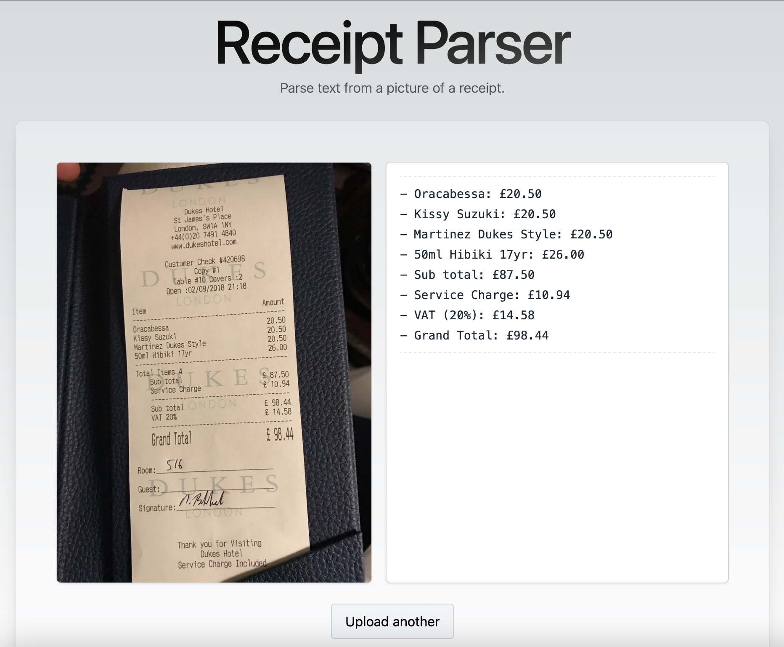
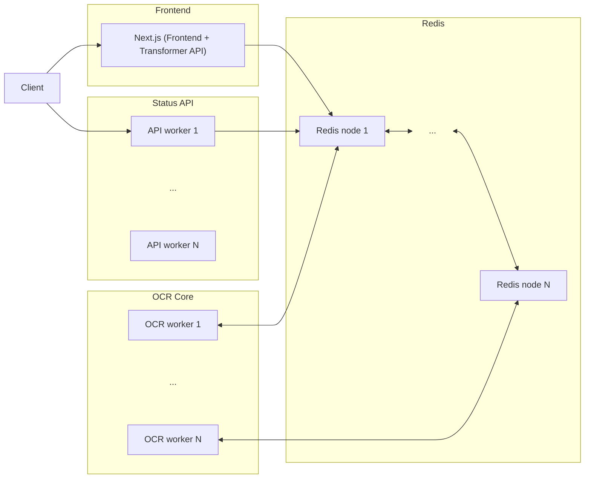
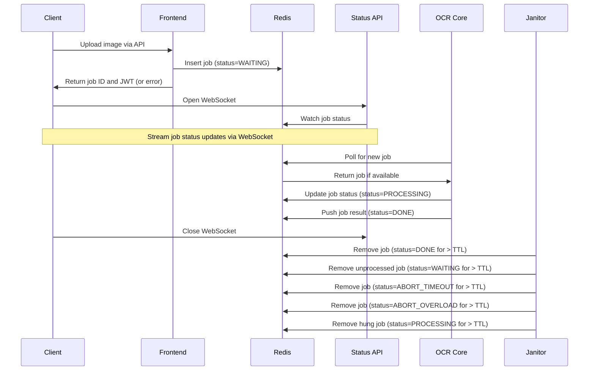
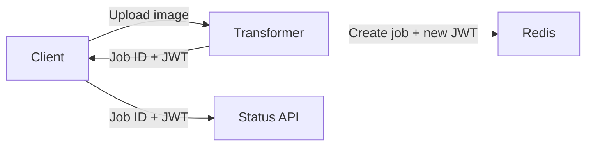
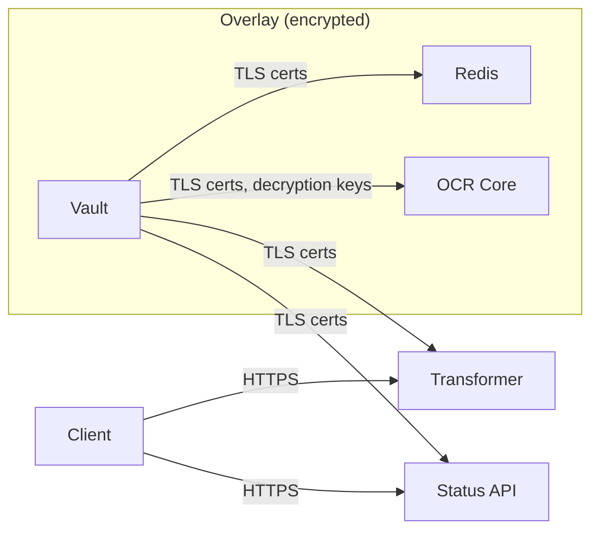
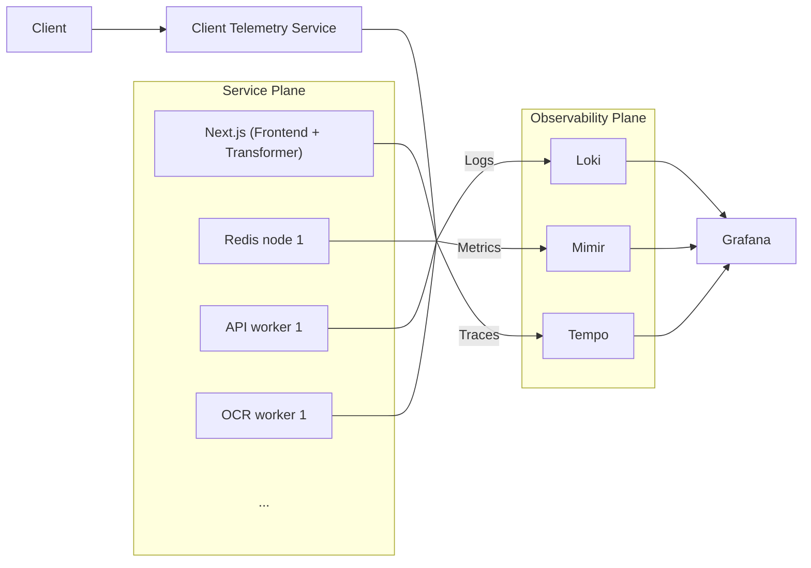

# Project Overengineer

An AI-powered service that converts receipt images into structured, itemized text.

Built for scalability and deployed to Kubernetes, this service includes comprehensive observability, telemetry, monitoring, and alerting infrastructure (standard as of 2025).

## Why?
As the name suggests, this project is intentionally overengineered beyond its simple purpose. The focus isn’t the service itself; it's an exercise in implementing everything around it!

## Running
There are a few ways to launch the service. **Note that the OCR service requires at least 11 GB of memory available (less than this and OCR will fail at request time).**

### Via `docker-compose`
From the project root, run `docker-compose up`, then access the frontend at `http://localhost:3000`.

### Via VS Code (debug)
Launch configurations are included in `.vscode/launch.json`. Start `Next.js: Debug server` and `Status API: Debug server`, then access the frontend at `http://localhost:3000`. The default value of `REDIS_PASSWORD` in dev is `b4yscx92yksfyv9c`.

### Config vars
Configuration is injected at runtime via environment variables, which can be overridden when starting each individual component or upon the call to `docker-compose up`. The value for `REDIS_PASSWORD` must be explicitly provided on startup.

| Variable             | Description                                                                                          | Default            |
| -------------------- | ---------------------------------------------------------------------------------------------------- | ------------------ |
| `REDIS_HOST`         | The hostname of the Redis master host.                                                               | `redis`            |
| `REDIS_PORT`         | The port number of the Redis master host.                                                            | `6379`             |
| `REDIS_PASSWORD`     | The password of the Redis master host.     | (unset) |
| `REDIS_REPLICA_PORT` | The port number of the Redis replica host.                                                           | `6379`             |
| `SENTINEL_HOST`      | The hostname of the Redis Sentinel host. Unset to connect directly to Redis instead of via Sentinel. | (unset)   |
| `SENTINEL_PORT`      | The port number of the Redis Sentinel host.                                                          | (unset)            |
| `STATUS_API_PORT`    | The port number the Status API should listen on.                                                     | `3001`             |

## Base architecture

The service consists of 5 components:

- **Client**: The Next.js frontend to the OCR service.
- **Frontend**: A Next.js app that both serves the client and exposes the Transformer API.
- **Redis**: A Redis cluster used to manage job data and state.
- **Status API**: An API which returns the status of a job (within Redis) both live and on-demand.
- **OCR Core**: A service which processes images within Redis and returns formatted text.
The API documentation is [here](./API-Docs.md).

## Flow

### Image upload

1. The receipt OCR service is exposed via a frontend Client with an image uploader function.
2. Upon file upload, the Client performs client-side file validation (restricting format and max file size).
3. The image is posted against a Transformer API.
4. The Transformer API performs server-side file validation.
5. The Transformer API transforms the image into a standard size and format.
6. The Transformer API generates a job ID.
7. The Transformer API writes the job ID, an initial job state of WAITING, a blob representation of the transformed image, a null field to store the future result, the current timestamp, and a generated JSON Web Token (JWT) to a Redis cluster.
8. The Transformer API returns the job ID and JWT to the Client.
9. The Client opens a WebSocket against a Status API, using the JWT as a bearer token.
10. The Client passes the job ID to the Status API.
11. The Status API watches the job state within the Redis cluster and sends updates to the Client so it can update the UI accordingly.

### Job processing

12. Workers in the OCR Core poll Redis for new jobs at a fixed interval.
13. When a worker finds a job, it updates the timestamp and job state (PROCESSING) within the Redis cluster.
14. The worker downloads the file blob associated with the job.
15. The worker processes the image for text.
16. The worker processes the text into a properly formatted version of the text.
17. The worker updates the timestamp, job state (DONE), and result field (with the updated text) within the Redis cluster.
18. The Status API returns the result of the processing to the Client.
19. The Client closes the WebSocket against the Status API.
20. The Client displays the result.

### Job cleanup

21. A Janitor service watches jobs within the Redis cluster to clean up jobs which breach a predefined job TTL.
22. The Janitor service removes any jobs in a state of DONE for more than the job TTL.
23. The Janitor service looks for any jobs in a state of PROCESSING for more than the job TTL. These jobs are set to an ABORT_TIMEOUT state (and the timestamp is updated), which updates the Client via the Status API, closes the WebSocket, and notifies the worker that the job should be aborted. If the canceled job was actively being processed by a worker within the OCR Core, the job is aborted and the worker becomes idle again. The Client displays a message saying the service timed out while processing the image and to attempt to resubmit the image.
24. The Janitor service looks for any jobs in a state of WAITING for more than the job TTL. These jobs are set to an ABORT_OVERLOAD state (and the timestamp is updated), which updates the Client via the Status API and closes the WebSocket. The Client displays a message saying the service is overloaded and to try again at a later time.
25. The Janitor service removes any jobs in a state of ABORT_TIMEOUT for more than the job TTL.
26. The Janitor service removes any jobs in a state of ABORT_OVERLOAD for more than the job TTL.

## Authentication

Components are protected by overlapping layers of access control based on whether they are exposed to the user or internal only.

- When a job is initially created, a JSON Web Token (JWT) is issued scoped to the individual job, stored in Redis, with a 5 minute expiry time. This token serves as a bearer token for all future requests against the Status API while the job and token are active.
- The Transformer API and Status API are the only two public-facing components; all other components accept internal traffic only, enforced by a separate private overlay network.
- Internal encrypted traffic is protected via mTLS for service-to-service authentication, with a [Caddy](https://caddyserver.com/) sidecar forwarding terminated traffic to the service worker process.
- Caddy's certificates are managed via the PKI functionality within an instance of [HashiCorp Vault](https://www.hashicorp.com/en/products/vault), allowing for automated rotation of mTLS certificates.

Authentication will be implemented in Phase 2.

## Encryption

Data is encrypted both in transit and at rest.

Encryption will be implemented in Phase 2.

### In transit

All service-to-service communication within the overlay network is encrypted using mTLS to ensure both confidentiality and authentication.

Public-facing APIs are secured with TLS, providing end-to-end encryption and server authentication for external clients.

### At rest

Image data within Redis is encrypted at rest (AES-256-GCM), with a unique, short-lived encryption key generated for each job. Keys are managed and rotated in Vault, ensuring image data is never stored in plaintext. Only the encrypted ciphertext, initialization vector (IV), and GCM tag are stored in Redis.

## Rate limits

Public-facing API endpoints are protected by IP-based rate limiting. Exceeding rate limits results in the client being served a `429 Too Many Requests` response.

| Component       | Limit               |
|-----------------|---------------------|
| Transformer API | 1 request/second    |
| Status API      | 1 request/second    |

## SLOs

- An image should be processed successfully within **300 seconds** (5 minutes) of being uploaded.
- The service should be available 99.0% of the time (maximum yearly downtime of **315,570 seconds**).

## Observability

To enforce the SLOs, all components within the system are expected to emit at least the following telemetry:

### Client

- JavaScript logs
- JavaScript client error rate
- JavaScript client call stack

### Frontend Cluster

- nginx logs
- 2xx response rate
- 4xx response rate
- 5xx response rate
- Response time
- Connection count
- CPU%
- Memory usage
- Network bytes in
- Network bytes out
- Heartbeat

### Transformer

- Application logs
- Transformer job count
- Transformer job duration (milliseconds)
- Transformer job success count
- Transfomer job error count
- CPU%
- Memory usage
- Network bytes in
- Network bytes out
- Heartbeat

### Redis

- Redis logs
- Active job count
- Waiting job queue size (excludes active jobs)
- Aborted job count
- Job table size
- Published event count
- Event stream queue size
- CPU%
- Memory usage
- Network bytes in
- Network bytes out
- Heartbeat

### Status API

- Application logs
- Active WebSocket connection count
- Aborted WebSocket connection count
- Closed WebSocket connection count (excludes aborted connections)
- 2xx response rate
- 4xx response rate
- 5xx response rate
- Response time
- Connection count
- CPU%
- Memory usage
- Network bytes in
- Network bytes out
- Heartbeat

### OCR Core

- Application logs
- Active workers
- Idle workers
- Error count
- Error traces
- CPU%
- Memory usage
- Network bytes in
- Network bytes out
- Heartbeat

## Observability plane architecture
Project Overengineer uses the Grafana stack for observability. All components are deployed locally (Grafana Cloud is not used).

- A telemetry sidecar is attached to each node in the service plane, which runs an instance of [Grafana Alloy](https://grafana.com/docs/alloy/latest/introduction/) (a Grafana-specific distribution of the [OpenTelemetry Collector](https://opentelemetry.io/docs/collector/)) to ingest logs, metrics, and traces.
- A standalone instance of Grafana Alloy is deployed to ingest client-side logs, metrics, and traces.
- Logs are shipped to Grafana Loki via OTLP.
- Metrics are shipped to Grafana Mimir via OTLP.
- Traces are shipped to Grafana Tempo via OTLP.
- A Grafana instance is configured to access these data sources for querying and visualization.

In Phase 4, telemetry will be used to feed alerting and automated deployment decisions (such as canary).

### Data Retention and Resolution

In lieu of log sampling, decisions on telemetry data resolution are configured within the observability plane.

| **Type**   | **Time Period** | **Resolution**    |
|------------|-----------------|-------------------|
| Logs       | 1 week          | full              |
| Logs       | >1 week         | _discarded_       |
| Metrics    | 1 week          | full              |
| Metrics    | >1 week         | 1 hour avg        |
| Metrics    | >1 month        | _discarded_       |
| Traces     | 1 week          | full              |
| Traces     | >1 week         | _discarded_       |

## Deployment

All components of the service plane are containerized. At build time, containers are built and pushed to GitHub Container Registry via the [Build and push images](https://github.com/OzuYatamutsu/project-overengineer/actions/workflows/build-and-push-images.yaml) workflow.

| Service name              | Image link                                                                                                                       |
| ------------------------- | -------------------------------------------------------------------------------------------------------------------------------- |
| `ollama-ocr`              | [project-overengineer/ollama-ocr](https://ghcr.io/ozuyatamutsu/project-overengineer/ollama-ocr:latest)                           |
| `project-overengineer-fe` | [project-overengineer/project-overengineer-fe](https://ghcr.io/ozuyatamutsu/project-overengineer/project-overengineer-fe:latest) |
| `status-api`              | [project-overengineer/status-api](https://ghcr.io/ozuyatamutsu/project-overengineer/status-api:latest)                           |
| `ocr-worker`              | [project-overengineer/ocr-worker](https://ghcr.io/ozuyatamutsu/project-overengineer/ocr-worker:latest)                           |
| `janitor`                 | [project-overengineer/janitor](https://ghcr.io/ozuyatamutsu/project-overengineer/janitor:latest)                                 |
| `redis-master`            | [project-overengineer/redis-master](https://ghcr.io/ozuyatamutsu/project-overengineer/redis-master:latest)                       |
| `redis-replica`           | [project-overengineer/redis-replica](https://ghcr.io/ozuyatamutsu/project-overengineer/redis-replica:latest)                     |
| `redis-sentinel`          | [project-overengineer/redis-sentinel](https://ghcr.io/ozuyatamutsu/project-overengineer/redis-sentinel:latest)                   |

A full standardized deployment process will be implemented in Phase 2.

## Roadmap

Development of Project Overengineer is intended to be iterative, with a proof of concept established in the initial phases, followed by supporting infrastructure in subsequent phases. A general outline of goals in scope for each phase is below:

### Phase 0

**Started 2025-04-22, completed 2025-05-18.**

- Project planning
- Design doc

### Phase 1

**Started 2025-06-23, completed 2025-09-06.**

- Implementation of the service plane
- Unit testing
- CI pipeline setup with enforced linting rules
- Rate limits

### Phase 2

**Started 2025-09-19.**

- Infrastructure management via Terraform
- CD pipeline setup
- End-to-end integration via Kubernetes
- Authentication
- Encryption at rest

### Phase 3

**Not yet started.**

- Implementation of the observability plane
- Staging deployment
- Live deployment

### Phase 4

**Not yet started.**

- Active monitoring and alerting
- Canary in staging
- Incremental production rollout based on telemetry data
- Automated rollback based on telemetry data
- Autoremediation based on telemetry data
